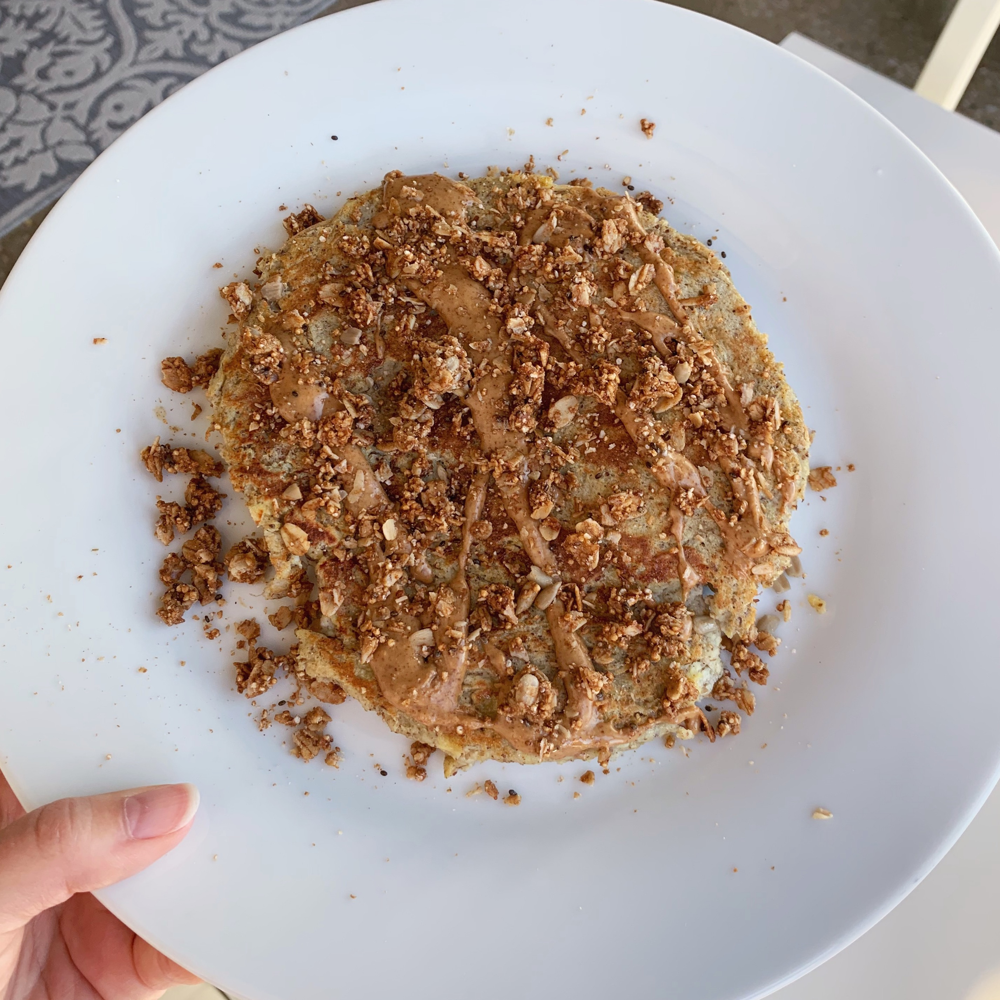

### Recipe 

* 1 ripe banana
* 2 eggs
* 1 tablespoon flaxseed meal
* 1 tablespoon coconut flour
* 1 teaspoon cinnamon
* ½ tablespoon coconut oil
* optional toppings: almond butter, maple syrup, granola

### Instructions

1.	Whisk 2 eggs in a bowl
2.	Add in 1 ripe banana, mashed
3.	Mix in flaxseed meal, coconut flour, and cinnamon until well combined
4.	Heat coconut oil in a skillet over medium heat
5.	Add pancake mixture to skillet, either making 4 small pancakes or 1 giant pancake 😊 
6.	Let first side cook for about 5 minutes or until able to slip spatula underneath and flip
7.	Cook second side for another 3 minutes
8.	Remove from skillet and top with almond butter, maple syrup, and granola of choice
