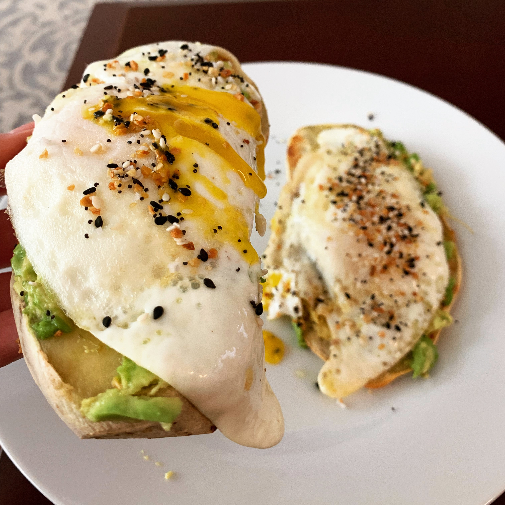

### Recipe

* 1 Japanese sweet potato
* ½ avocado
* 2 eggs
* 1 tablespoon olive oil
* everything but the bagel seasoning

### Instructions

1.	Preheat oven to 400˚F
2.	Peel Japanese sweet potato and slice lengthwise into ¼ inch thick pieces (the number of pieces will depend on how large the sweet potato is, but you can roast all the pieces and store what you don’t use in the fridge to have toasts all week long! Just re-heat the pieces in a sauté pan or in a toaster when you want them)
3.	Bake sweet potato slices for 20 minutes. Flip, then bake another 10 minutes
4.	Heat oil in a skillet and fry two eggs 
5.	Mash the avocado and spread on 2 pieces of sweet potato toast
6.	Then top the toasts with the fried eggs and sprinkle with everything but the bagel seasoning

