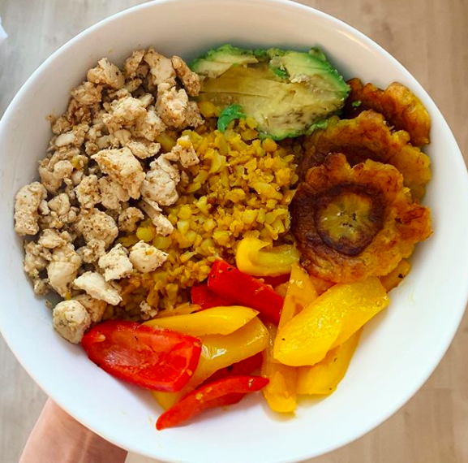

### Recipe 

* 1 pound ground turkey 
* ½ bag cauliflower rice
* 1 bell pepper
* paleo tostones (see paleorunningmomma’s recipe here)
* 1 T olive or avocado oil
* 1-2 minced garlic cloves
* 1 t tumeric
* salt & pepper
* taco seasoning (either a prepared packet or mix your own using salt, pepper, cumin, paprika, garlic powder)

### Instructions 

1. Heat skillet and add in ground turkey and taco seasonings. Cook until no pink left.
2. Heat a separate skillet with oil and add in cauliflower rice, minced garlic, turmeric, and salt and pepper. Saute for a few minutes and then add in sliced bell pepper. Cook 5-10 minutes until pepper is softened to your liking
3. Add turkey and veggies to a bowl and serve with avocado and tostones!

