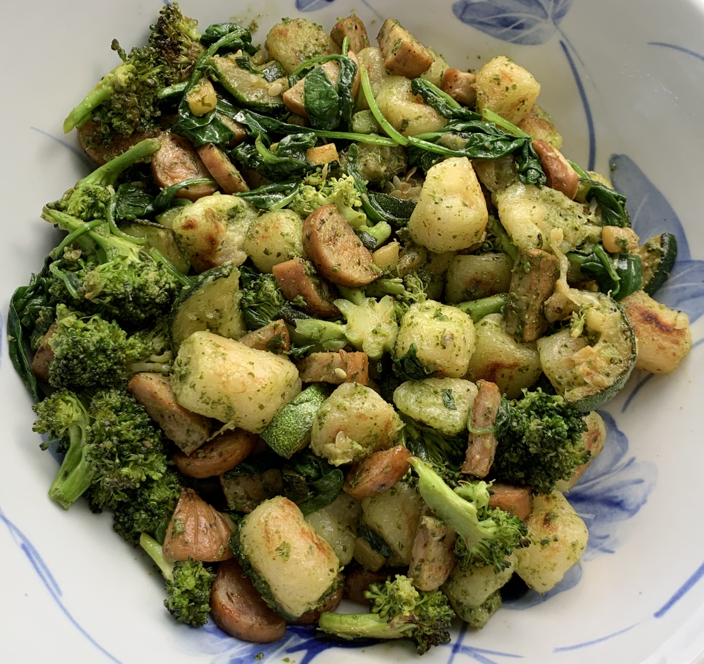

### ~Serves 3

### Recipe 

* 1 bag of cauliflower gnocchi (Trader Joe’s is my fave!)

* 2-3 links pre-cooked chicken sausage (frozen works too), cut into half-moons

* 1 zucchini, cut into half-moons

* 1 head of broccoli, cut into florets

* 1 handful of spinach

* 2 T olive oil

* 2-3 T vegan pesto

* salt & pepper

### Instructions

1.     Heat 1 T olive oil in a skillet and sauté broccoli and zucchini with salt and pepper for 10-15 minutes until cooked to your liking

2.     Meanwhile heat another 1 T of oil in a separate skillet and add in bag of cauliflower gnocchi

3.     Let gnocchi cook without touching for about 5 minutes, then flip and cook the other side for another 5 minutes or longer until all sides are crispy (total time should be about 10-15 minutes)

4.     Heat a third skillet and add in chicken sausage pieces to brown (you can also move the veggies to the side and use the same skillet to brown the chicken sausage)

5.     When veggies are cooked, add in a handful of spinach to wilt

6.     Mix everything together and top with vegan pesto of choice

7.     Enjoy!

