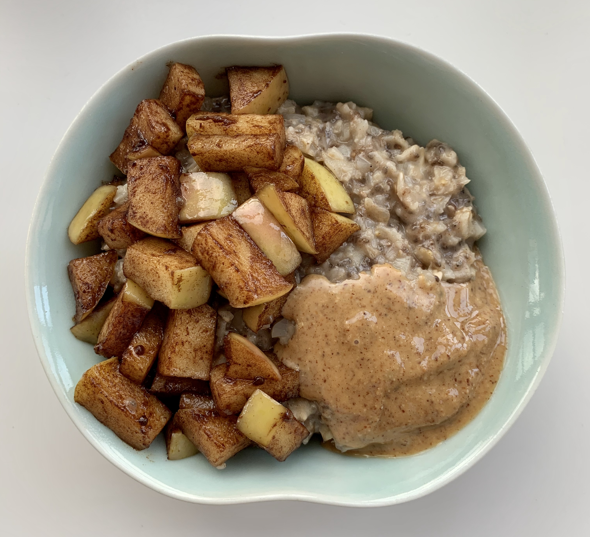

### Recipe

#### Cauli-Oats

· 1/3 cup old-fashioned oats

· ¼ cup frozen cauliflower rice

· 1/3 cup almond milk

· 1/3 cup water

· 1 t coconut sugar

· ½ t cinnamon

· ½ t vanilla extract

· 1 T chia seeds

· Pinch of sea salt

· 1 T almond butter

#### Sauteed Apples

· ½ t coconut oil

· ½ apple, diced

· ½ t cinnamon

· 1 t coconut sugar

### Instructions

1.  Add all the cauli-oat ingredients to a small saucepan

2.  Bring to a boil and then lower heat slightly, stirring often for 5-10 minutes until liquid is absorbed and oats are cooked to your liking (you might need to add another splash of almond milk if the oats get too thick)

3.  Meanwhile, heat coconut oil in a skillet

4.  Add apples, cinnamon, and coconut sugar and sauté apples for 5-10 minutes until softened

5.  Add cauli-oats to a bowl and top with sauteed apples and a spoonful of almond butter
