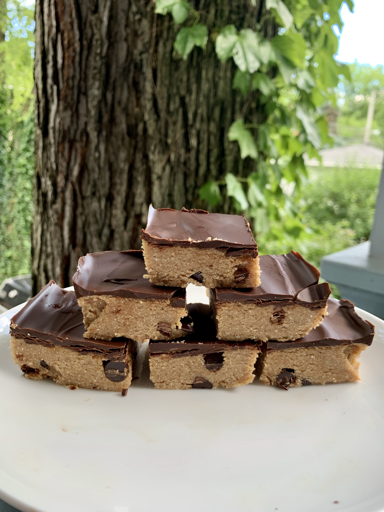

### Recipe 

  * 1 1/4 cup almond flour
  *  1/4 cup coconut flour
  *  1 tsp cinnamon
  *  1/4 cup almond butter
  *  1/4 cup tahini
  *  3 tsp melted coconut oil
  *  1/4 cup dairy-free chocolate chips
  *  chocolate topping:
  *  1/2 cup dairy-free chocolate chips
  *  1 tsp coconut oil

### Instructions
1.     Line loaf pan with parchment paper and coat lightly with melted coconut oil
2.     Mix together almond flour, coconut flour, and cinnamon in a large bowl
3.     Add in remaining ingredients and mix until well-combined
4.     Transfer to loaf pan and press down until cookie dough is evenly distributed
5.     Place loaf pan in the freezer for 15 minutes to set
6.     Meanwhile prepare chocolate topping by melting 1/2 cup chocolate chips with 1 tsp coconut oil in the microwave on 30-second intervals, stirring until chocolate is completely melted
7.     Remove loaf pan from freezer and add melted chocolate
8.     Return to freezer for another 5-10 minutes
9.     Once chocolate is set, use the parchment paper to help slide the cookie dough out from the pan
10.  Lay on cutting board and use a sharp knife to cut into squares
11.  Enjoy! Store in an airtight container in the fridge 