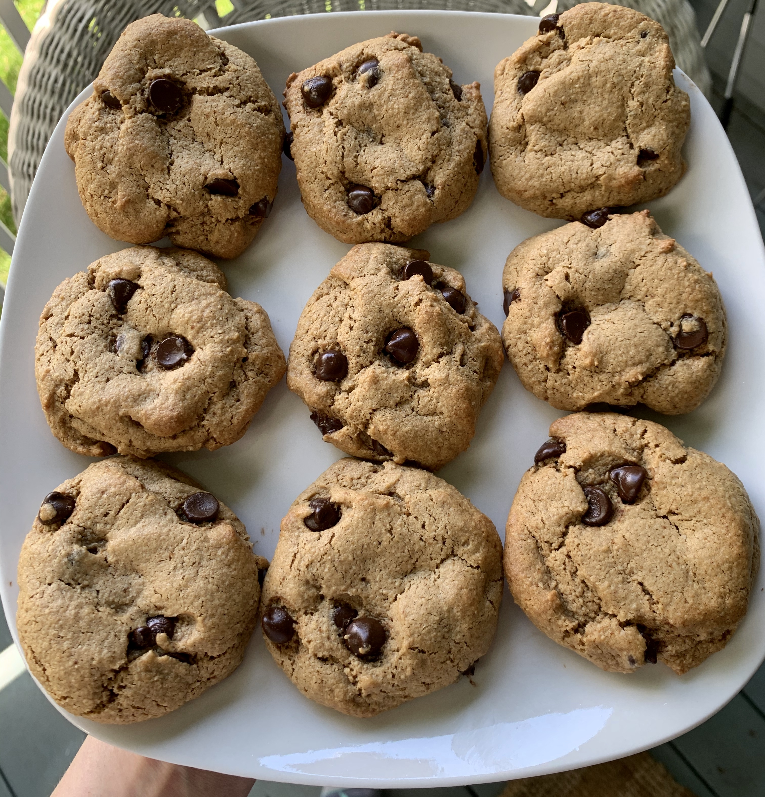

### Makes 10-12 Cookies 

### Recipe 
* 1 egg

* ¼ cup coconut oil, melted and cooled

* 1 T vanilla extract
* ¼ cup creamy almond butter (should be pretty drippy, another nut butter could also work here!)

* ½ cup coconut sugar
* 1 cup almond flour
* 2 T coconut flour
* ½ tsp baking soda
* pinch of sea salt
* ½ dairy free cup chocolate chips

### Instructions
1.     Preheat oven to 350 degrees and line a large sheet pan with parchment paper

2.     Beat egg and whisk in melted coconut oil, coconut sugar, vanilla extra, and almond butter until well combined

3.     Add in almond flour, coconut flour, baking soda and salt and mix well until all the flour is mixed into the dough (dough will be a little sticky)

4.     Fold in chocolate chips

5.     Use spoon to help scoop out cookies onto parchment paper

6.     Wet hands slightly with water to help shape cookies, pressing down slightly

7.     Bake cookies for 10-12 minutes until edges start to brown slightly

8.     Let cookies cool and enjoy! 