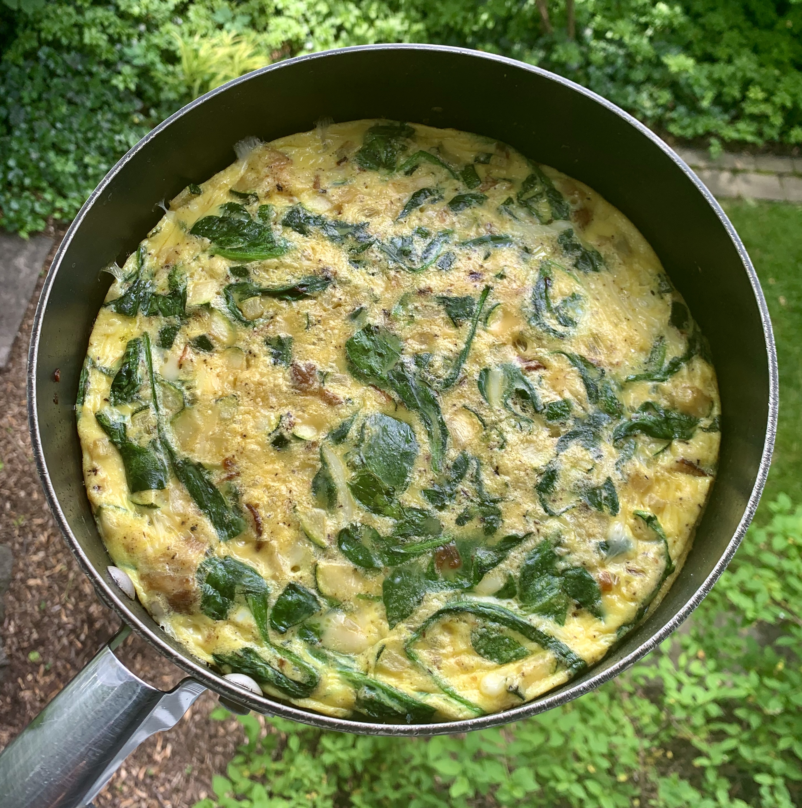

### Recipe 
* 10 eggs, whisked

* 6 strips of sugar-free bacon

* 1 small zucchini or ½ large zucchini, diced

* 1 small onion, diced

* ¼ cup dairy free mozzarella (optional)

* 1 T avocado or olive oil

* 1 cup spinach

* 2 T almond milk

* 1 tsp seasoning of choice (I used one that has sea salt, rosemary, garlic, sage, and black pepper)

* salt and pepper

### Instructions
1.     Preheat oven to 400 degrees

2.     Line sheet pan with tin foil, add bacon, and bake for 20 minutes until crisped to your liking

3.     Meanwhile add 1 T of oil to oven-safe skillet and sauté onion with salt and pepper until softened, about 10 minutes

4.     Add in diced zucchini and sauté for another 5-7 minutes

5.     Add in a cup of spinach to wilt

6.     Remove skillet from heat when spinach is wilted

7.     Whisk 10 eggs in a bowl with almond milk and add in seasoning of choice

8.     When bacon is done, cut it up into bite sized pieces and add to skillet

9.     Add whisked eggs to skillet along with the mozzarella and stir until everything is evenly distributed

10.  Lower oven to 350 degrees and bake frittata for about 20 minutes, until eggs are set

11.  Let rest for 5 minutes and enjoy!