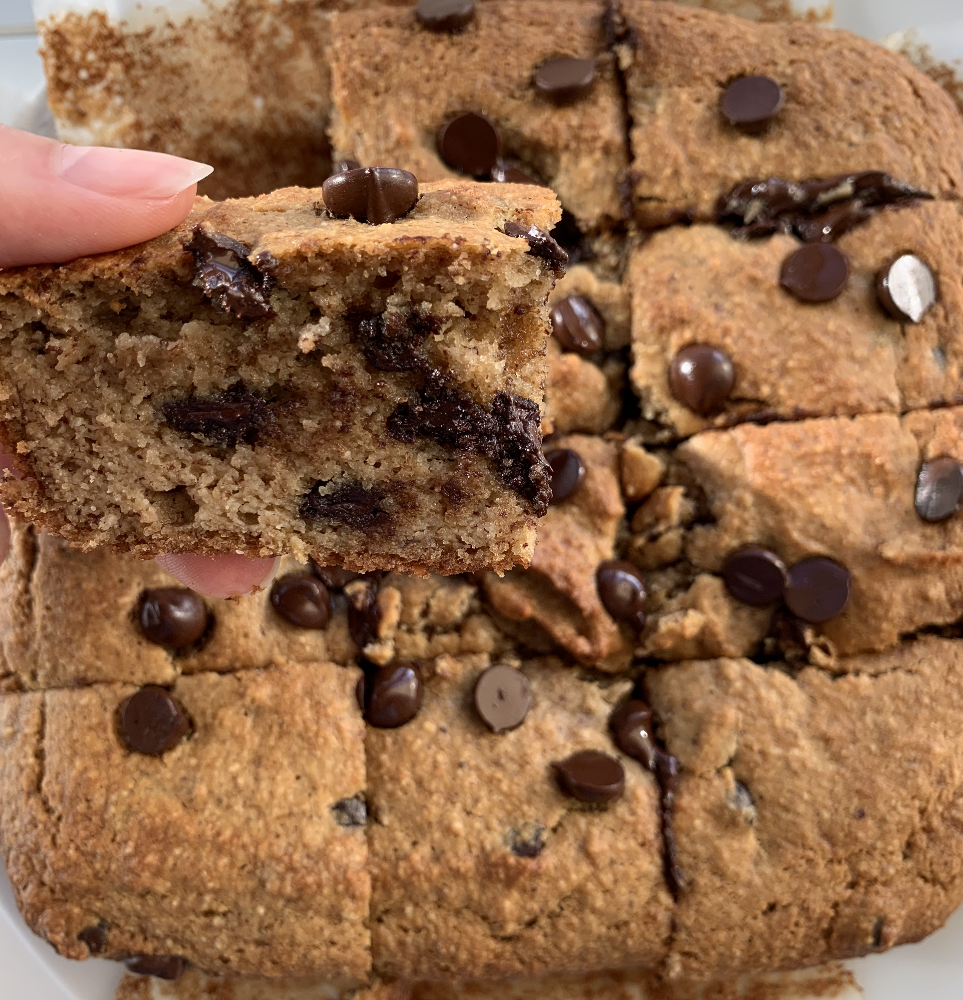

### Recipe

- 2 ripe bananas

- 2 eggs

- 1/4 cup olive oil

- 1/4 cup maple syrup

- 1/4 cup almond butter

- 1 tsp vanilla extract

- 1 1/2 cups almond flour

- 3 T coconut flour

- 1 t baking soda

- Pinch of sea salt

- Dash of cinnamon

- 1/2 cup chocolate chips (+ more for topping)

### Instructions

1.  Preheat oven to 350 and line an 8x8 baking dish with parchment paper
2.  Mash bananas with a fork or electric mixer
3.  Add in eggs and mix with electric mixer (or whisk)

4.  Add in remaining wet ingredients (olive oil, maple syrup, almond butter, and vanilla extract) and mix again

5.  Add in almond flour and mix

6.  Add in remaining dry ingredients (coconut flour, baking soda, sea salt and cinnamon) and mix until everything is incorporated

7.  Stir in chocolate chips

8.  Pour batter into baking dish and bake for 35-45 minutes until toothpick comes out clean
