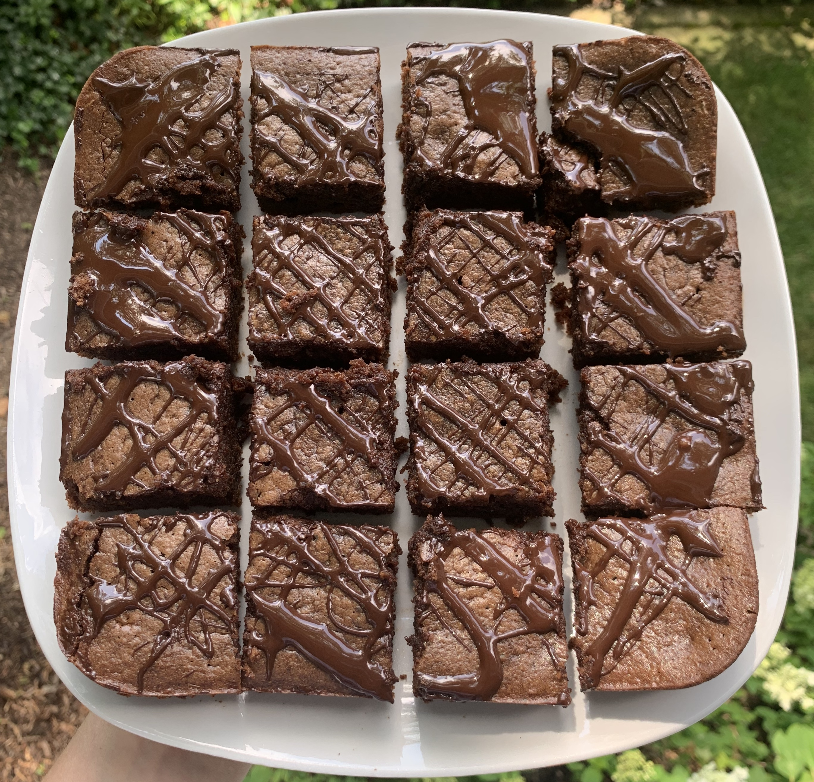

### Recipe 
 * 2 eggs

 * 1 t vanilla extract

 * ½ cup almond butter

 * ¼ cup coconut oil, melted and cooled

 * ¼ cup maple syrup

 * ¼ cup coconut sugar

 * 1/3 cup cacao powder

 * 1/3 cup almond flour

 * ¼ tsp baking soda

 * pinch of sea salt

 * 1/3 cup dairy- free chocolate chips

 * chocolate drizzle: ¼ cup chocolate chips and ½ tsp coconut oil

### Instructions
1.     Preheat oven to 350 degrees

2.     Grease a 8x8 pan with melted coconut oil

3.     Whisk eggs together in a large bowl

4.     Add wet ingredients (vanilla, almond butter, coconut oil, maple syrup and coconut sugar) and whisk until well combined

5.     Add in dry ingredients (cacao powder, almond flour, baking soda and salt) and mix together with a large spoon or spatula until well combined

6.     Stir in chocolate chips

7.     Transfer batter into greased 8x8 and bake for about 22 minutes until toothpick comes out clean

8.     While brownies are cooling make chocolate drizzle by microwaving chocolate chips and coconut oil in one minute intervals until melted

9.     Drizzle chocolate on top of brownies and enjoy!  