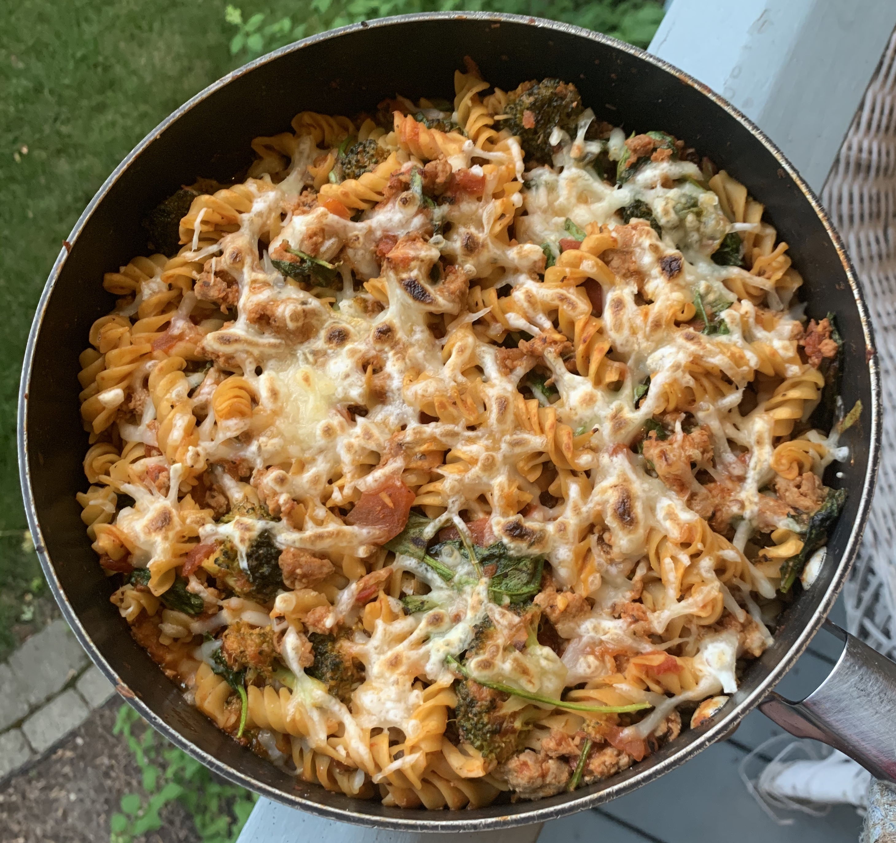

#### ~inspired by @nobread and @broccyourbody Cauliflower Gnocchi Skillet~

### Serves 4-5

### Recipe 
* 1 head broccoli, chopped into small florets

* 1 lb ground turkey

* 1 box pasta of choice (I use Banza chickpea pasta)

* 1 jar tomato basil sauce

* 1 cup spinach

* 1/3 cup dairy-free mozzarella

### Instructions
1.     Bring large pot of salted water to a boil

2.     Cook up ground turkey in an oven-safe large skillet

3.     Meanwhile steam broccoli florets for 10 minutes, until tender (you can also sauté broccoli)

4.     When water is boiling, cook pasta according to box instructions

5.     When turkey is cooked, add steamed broccoli, sauce, and spinach to skillet to heat sauce and wilt spinach

6.     Drain pasta and add to skillet, mixing with other ingredients until everything is evenly distributed

7.     Set oven to broil setting

8.     Top skillet with mozzarella and broil for 4ish minutes – watch closely to make sure the cheese doesn’t start to burn!

9.     Remove from oven carefully and enjoy