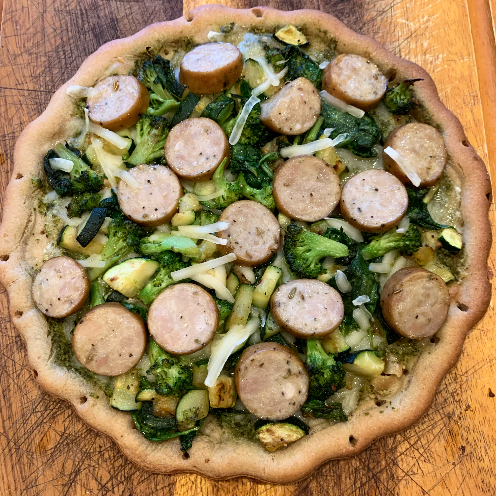

### Serves ~2

### Recipe 
* 1 gluten-free pizza crust

* ½ zucchini, diced small

* 4 large broccoli florets, cut into small pieces

* 1 cup spinach

* 2 T vegan pesto or marinara

* ¼ cup vegan cheese

* 1 link pre-cooked chicken sausage

* 1 T olive oil

* salt and pepper

### Instructions

1.     Preheat oven to 425 degree

2.     Heat 1 T of olive oil and sauté zucchini and broccoli with salt and pepper for 10 minutes until soft

3.     Add in spinach to wilt

4.     Spread pesto or marinara onto pizza crust

5.     Layer on cheese, veggies and chicken sausage

6.     Bake for 13-18 minutes (follow instructions on pizza crust box)

7.     Enjoy!