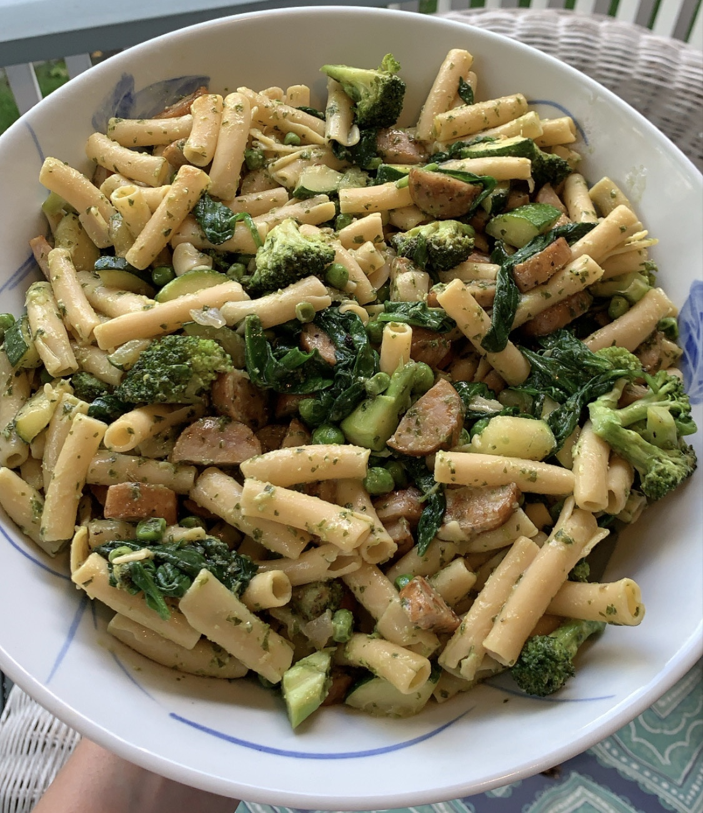

### Serves ~4

### Recipe 

* 1 package pasta of choice (I use Banza chickpea pasta)

* 1 head broccoli, chopped into small florets

* 1 zucchini, chopped into ¼ inch pieces

* 1 T olive oil

* 3 links pre-cooked chicken sausage, sliced into half moons

* ½ cup frozen peas

* 1 cup spinach

* ¼ cup dairy-free pesto

### Instructions

1. Boil large pot of water and add 1 tsp salt

2. Heat 1 T of olive oil in skillet and sauté broccoli and zucchini for about 10-15 minutes until cooked to your liking

3. Meanwhile heat separate skillet and brown chicken sausage pieces (should take about 10 minutes)

4. Add box of pasta to boiling water and cook according to box instructions

5. When veggies are done, add in frozen peas to thaw and spinach to wilt

6. Drain pasta and toss with veggies, sausage and vegan pesto

7. Enjoy! 