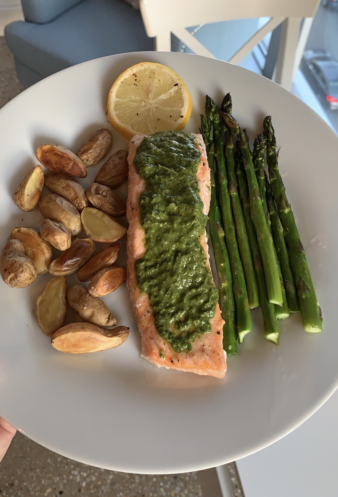

### Recipe 

* 2 salmon fillets
* 1 bunch of asparagus
* 1 bag baby potatoes
* 1 lemon
* pesto of choice
* 1 t garlic powder
* salt & pepper

### Instructions

1.	Preheat oven to 400F
2.	Slice baby potatoes in half and toss with olive oil, garlic powder, salt and pepper
3.	Roast potatoes for 40 minutes, tossing halfway through
4.	Turn oven up to 425 (leave potatoes in)
5.	 Toss asparagus and sliced lemon with olive oil, salt and pepper and place on another sheet pan
6.	Pat salmon fillets dry with paper towel and add to sheet pan with asparagus and lemon, adding extra oil and seasonings if necessary to coat both sides of the salmon
7.	Add sheet pan with salmon, asparagus and lemon to the 425F oven and cook for 12-15 minutes, depending on the thickness of salmon
8.	Remove both sheet pans from oven and let rest for 2 minutes
9. Top salmon with pesto and enjoy! 
