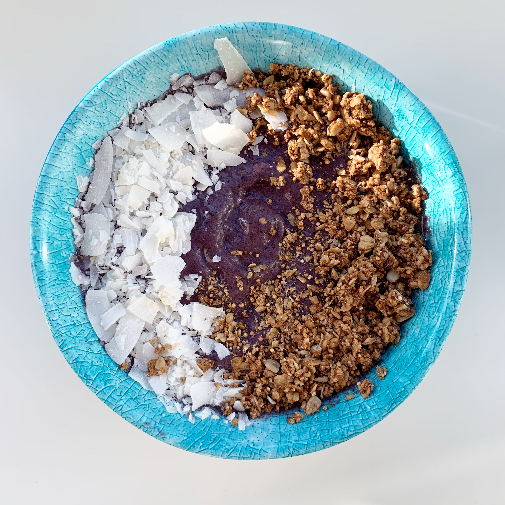

### Recipe 
*    ½ frozen banana
*    ½ cup frozen blueberries
*    ¼ - ½ frozen zucchini (sliced pre-freezing)
*    1 cup frozen spinach or 1 big handful fresh spinach
*    1 T almond butter
*    1 T flaxseed meal (optional)
*    1 T hemp seeds
*    1 t vanilla extract
*    ½ t cinnamon
*    almond milk and coconut water
*    shredded coconut
*    granola

### Instructions

1.     Blend all ingredients in high-speed blender
2.     Start with less liquid (you can do either almond milk or coconut water – I recommend a mix of both) and add as needed for desired thickness
3.     Top with shredded coconut and granola 
