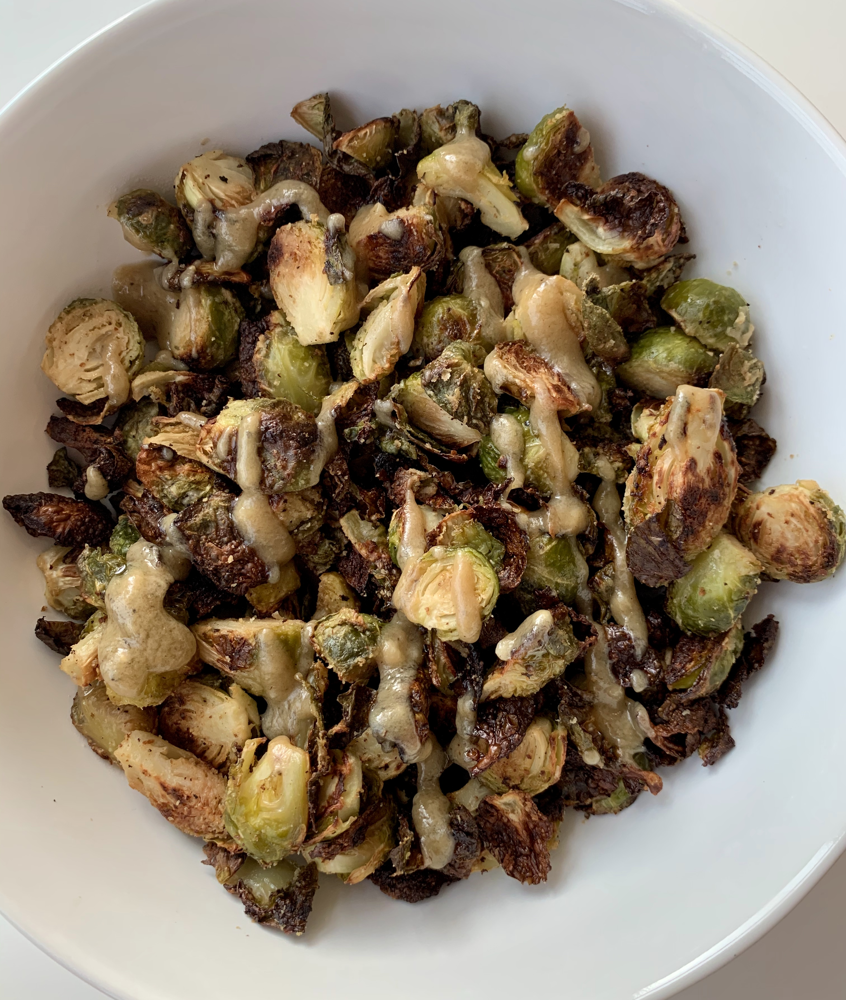

### Recipe 
* ~1 pound brussel sprouts 

* 2 T olive oil

* 2 T tahini

* 1 T lemon juice (about 1/2 lemon, juiced)

* 1 garlic clove, minced

* 1 t maple syrup

* salt and pepper to taste

### Instructions

1.    Preheat oven to 400 degrees

2.  Trim the bottoms of the brussel sprouts and cut in half

3.  Whisk remaining ingredients together in a bowl and toss with brussel sprouts (reserve about 1 T of the sauce to drizzle after roasting)

4.     Roast brussel sprouts at 400 degrees for 20 minutes, then toss brussels and up heat to 425

5.     Roast for another 10 minutes until brussels are crisped to your liking

6.     Remove from oven and drizzle with remaining sauce

7.     Enjoy!
