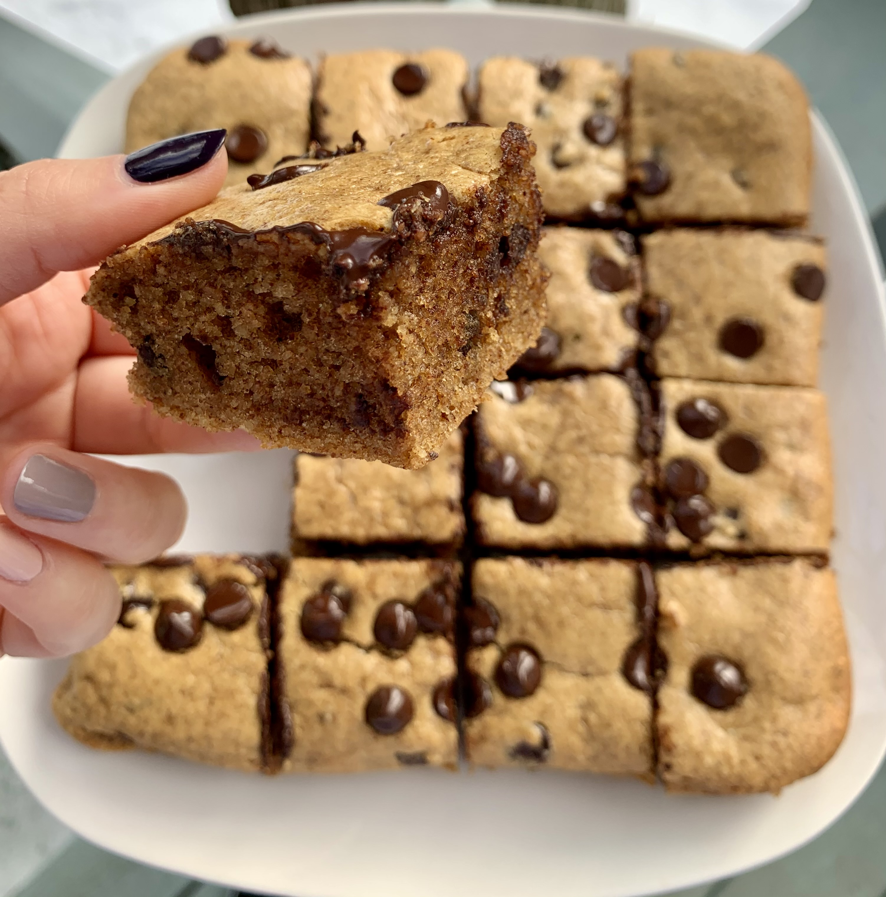

### Recipe

· 2 eggs

· ¼ cup coconut oil, melted and cooled

· ½ cup almond butter

· 1 t vanilla extract

· ¼ cup maple syrup

· 1 cup almond flour

· ½ tsp baking soda

· Pinch of sea salt

· ½ cup chocolate chips (+ more for topping)

### Instructions

1.      Preheat oven to 350 degrees

2.      Line 8x8 baking dish with parchment paper

3.      Whisk eggs, coconut oil, almond butter, vanilla, and maple syrup until smooth

4.      Add in dry ingredients: almond flour, baking soda, and sea salt and mix until everything is combined

5.      Mix in chocolate chips

6.      Pour batter into 8x8 and top with additional chocolate chips

7.      Bake for 22-25 minutes, until starting to brown slightly and toothpick inserted comes out clean
