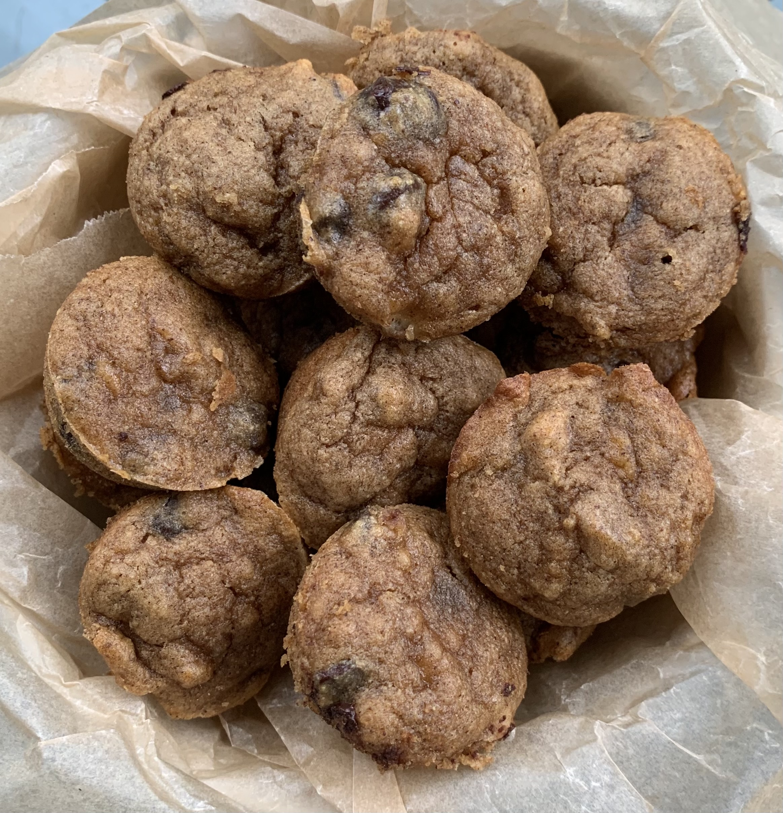

### Recipe

- 1 ripe banana

- 1 egg

- 3 T olive oil

- ¼ cup almond butter

- 2 T maple syrup

- 1 t vanilla extract

- ¼ cup coconut flour

- ½ t baking soda

- ½ t cinnamon

- Pinch of sea salt

- ½ cup chocolate chips

### Instructions

1.          Preheat oven to 350 degrees

2.          Grease mini muffin tin (I used a coconut oil spray)

3.          Mash banana and whisk in egg

4.          Whisk in remaining wet ingredients

5.          Add in dry ingredients and mix under well combined

6.          Add in chocolate chips and mix again

7.          Spoon batter into mini muffin tin (makes about 18 mini muffins) **note: you can try baking in regular muffin tin, but will have to extend baking time**

8.          Bake for 10-12 minutes until toothpick comes out clean

9.          Enjoy!!
