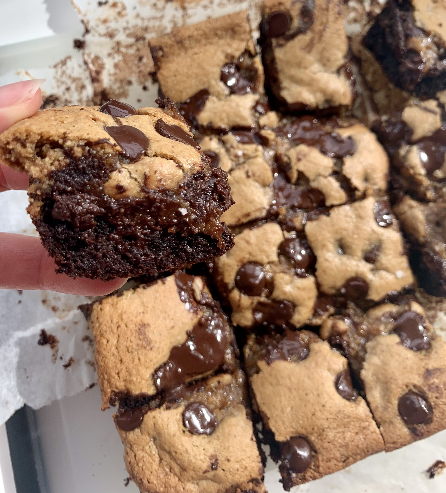

### Recipe

#### Brownie layer:

- 1 egg

- ¼ cup olive oil

- ¼ cup maple syrup

- 1/3 cup almond butter

- 1 t vanilla extract

- 1/3 cup cacao powder

- ½ t baking soda

- Pinch of sea salt

- ¼ cup chocolate chips

#### Cookie (dough) layer:

- 1 egg

- ¼ cup coconut oil, melted and cooled

- ½ cup coconut sugar

- ¼ cup almond butter

- 1 t vanilla extract

- 1 cup almond flour

- ½ tsp baking soda

- Pinch of sea salt

- ½ cup chocolate chips

### Instructions

1.      Preheat oven to 350

2.      Line 8x8 pan with parchment paper

3.      Whisk together wet ingredients for brownie layer

4.      Then add in dry and mix well, stirring in chocolate chips at the end

5.      Pour into baking pan (brownie dough will be a bit sticky, do your best to spread evenly)

6.      Then whisk together wet ingredients for the cookie layer

7.      Add in dry ingredients and mix well, stirring in chocolate chips

8.      Spread out cookie layer on top of brownie layer

9.      Top with more chocolate chips

10. Bake for 22-25 minutes (if you want the cookie layer more set and less dough-y, bake for a few more minutes!)

11. Top with flakey sea salt.

12. Enjoy!
