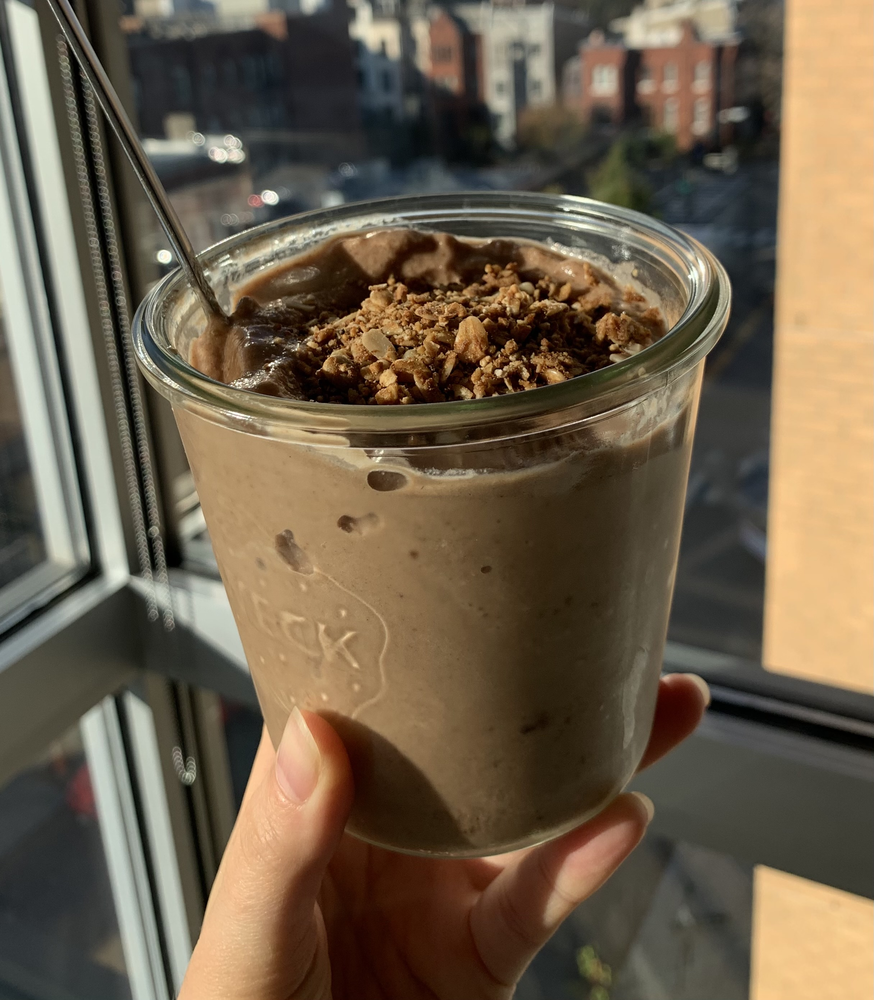

### Recipe

- 1 frozen banana

- 1 cup frozen cauliflower rice

- 1 cup ice

- 1 date (optional, or drizzle of honey to sweeten)

- 1 T almond butter

- 1 T cacao powder

- ½ t vanilla extract

- ½ t cinnamon

- 1 scoop collagen or protein powder

- Almond milk/coconut water to blend

### Instructions

1.       Blend everything together in a high-powered blender

2.       Start with a small amount of liquid and add more as necessary to blend (it helps to use a tamper stick to get things going)

3.  Enjoy
