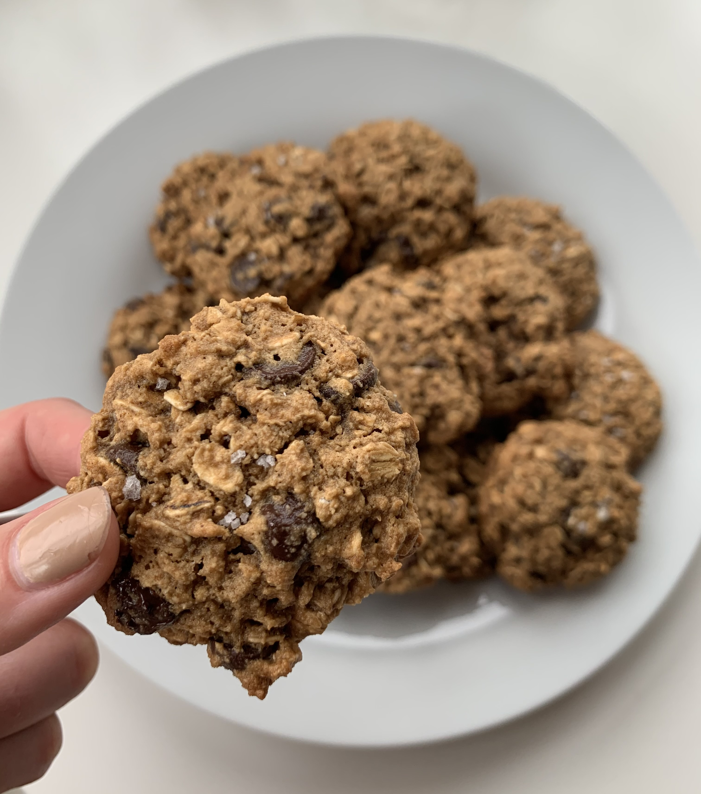

### Recipe

· 1 egg

· 2 T olive oil

· ½ cup coconut sugar

· 2 T maple syrup

· 1 t vanilla extract

· 1 ½ cup gluten free rolled oats

· 1 cup almond flour

· ½ t baking soda

· Pinch of sea salt

· ½ cup chocolate chips

### Instructions

1.           Preheat oven to 350

2.           Beat the egg and whisk in olive oil, vanilla extract, coconut sugar, and maple syrup until well combined

3.           Add in remaining dry ingredients and mix well

4.           Stir in chocolate chips

5.           Use a spoon or cookie scoop and add cookie dough balls to parchment paper lined (or greased) cookie sheet (should make about 18 cookies)

6.           Press dough down slightly with your hand

7.           Bake for ~12 minutes until edges begin to brown

8.           Remove from oven and top with flakey sea salt

9.           Enjoy!
